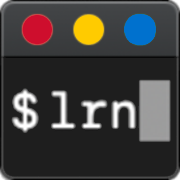

Learnosity Python SDK
=====================

[](https://crate.io/packages/learnosity_sdk/)
[](https://badge.fury.io/gh/Learnosity%2Flearnosity-sdk-python)
[](https://travis-ci.org/Learnosity/learnosity-sdk-python)

This package was based off the [PHP
SDK](https://github.com/Learnosity/learnosity-sdk-php), with some small
adjustments to be more pythonic.

Supports:

* generating init packets for Learnosity JavaScript APIs
* server-side Data API usage

This also provides a command-line tool, [`lrn-cli`](#lrn-cli) allowing to easily
interact with the Learnosity APIs (most useful for the Data API).

# Supported Python Versions

These are the versions we test for:

* 3.3.x
* 3.4.x
* 3.5.x
* 3.6.x
* 3.7.x
* 3.8.x

# Installation

To install from PyPi:

    pip install learnosity_sdk

Or, from a checkout of this repo:

    pip install .

# Upgrading

If installed from pypi:

    pip install --upgrade learnosity_sdk

Or just do a pull from GitHub and run again in the repo:

    pip install .

# Usage

## Questions API

```python
import learnosity_sdk.request

# Security packet including consumer key
security = {
  'consumer_key': 'MY_API_KEY',
  'domain': 'localhost',
  'user_id': '$ANONYMIZED_USER_ID'
}
# consumer secret for API access
# WARNING: The consumer secret should not be committed to source control.
secret = 'MY_API_SECRET'

# request data for Questions API
questions_request = {
    "type": "local_practice", "state": "initial",
    "questions": [
        {
            "response_id": "60005",
            "type": "association",
            "stimulus": "Match the cities to the parent nation",
            "stimulus_list": [
                "London", "Dublin", "Paris", "Sydney"
            ],
            "possible_responses": [
                "Australia", "France",
                "Ireland", "England"
            ],
            "validation": {
                "valid_responses": [
                    ["England"], ["Ireland"], ["France"], ["Australia"]
                ]
            }
        }
    ]
}

questions_init = learnosity_sdk.request.Init(
    'questions', security, secret,
    request=questions_request
)

# Get the JSON that can be rendered into the page and passed to LearnosityApp.init
signed_request = questions_init.generate()
```

## Items API

Request packet generation containing signature could look as follows:
```python
#!/usr/bin/env python
from learnosity_sdk.request import Init
from learnosity_sdk.utils import Uuid

# Security packet including consumer key
security = {
  'consumer_key': 'yis0TYCu7U9V4o7M',
  # Change to your domain, e.g. 127.0.0.1, learnosity.com
  'domain': 'localhost',
}
# consumer secret for API access
# WARNING: The consumer secret should not be committed to source control.
secret = '74c5fd430cf1242a527f6223aebd42d30464be22'

# example request data for Items API
items_request = items_request = {
    "rendering_type": "inline",
    "user_id": "$ANONYMIZED_USER_ID",
    "session_id": Uuid.generate(),
    "type": "submit_practice",
    "activity_id": "exampleActivity",
    "name": "Items API demo - inline activity.",
    "items": [
        "classification_1",
        "multiple_choice_1"
    ]
}

init = Init(
    'items', security, secret,
    request=items_request
)

# Get the JSON that can be rendered into the page and passed to LearnosityItems.init
print(init.generate())
```
Corresponding HTML template (using Django template markup):
```html
<html>
    <head>
    </head>
    <body>
        <script src="https://items.learnosity.com/?v1"></script>
        <span class="learnosity-item" data-reference="multiple_choice_1"></span>
        <span class="learnosity-item" data-reference="classification_1"></span>
        <script>
            <!-- `generated` should be the unescaped string obtained from Init.generate() method -->
            var itemsApp = LearnosityItems.init({{ generated|safe }});
        </script>
    </body>
</html>
```


## Data API

```python
import json

from learnosity_sdk.request import DataApi

security = {
    'consumer_key': 'MY_API_KEY',
    'domain': 'localhost'
}
# WARNING: The consumer secret should not be committed to source control.
consumer_secret = 'MY_API_SECRET'

endpoint = 'https://data.learnosity.com/latest/itembank/items'
data_request = {
    'references': ['item_1', 'item_2'],
}
action = 'get'

client = DataApi()

# make a single request for the first page of results
# returns a requests.Response object
res = client.request(endpoint, security, consumer_secret, data_request, action)
# print the length of the items list (for the first page)
print(len(res.json()['data']))

# iterate over all results
# this returns an iterator of results, abstracting away the paging
for item in client.results_iter(endpoint, security, consumer_secret, data_request, action):
    # prints each item in the result
    print(json.dumps(item))

# request all results as a list
# using `list` we can easily download all the results into a single list
items = list(client.results_iter(endpoint, security, consumer_secret, data_request, action))
# print the length of the items list (will print the total number of items)
print(len(items))

# iterate over each page of results
# this can be useful if the result set is too big to practically fit in memory all at once
for result in client.request_iter(endpoint, security, consumer_secret, data_request, action):
    # print the length of each page of the items list (will print a line for each page in the results)
    print(len(result['data']))
```

## Events API

```python
import learnosity_sdk.request

# Security packet including consumer key
security = {
  'consumer_key': 'MY_API_KEY',
  'domain': 'localhost',
  'user_id': '$ANONYMIZED_USER_ID'
}
# consumer secret for API access
# WARNING: The consumer secret should not be committed to source control.
secret = 'MY_API_SECRET'

# request data for Questions API
events_request = {
	"users": [ "$ANONYMIZED_USER_ID_1", "$ANONYMIZED_USER_ID_2", "$ANONYMIZED_USER_ID_3"  ]
}

events_init = learnosity_sdk.request.Init(
    'events', security, secret,
    request=events_request
)

# Get the JSON that can be rendered into the page and passed to LearnosityApp.init
signed_request = events_init.generate()
print(signed_request)
```

# Learnosity CLI tool (lrn-cli)



The `lrn-cli` tool allows to exchange JSON payloads with the Learnosity APIs
without having to worry about signature generation.

In a nutshell, it can be used as follows

	$ lrn-cli --consumer-key CONSUMER_KEY --consumer-secret --request-json '{}' CONSUMER_SECRET API ENDPOINT

By default, the demonstration consumer credentials will be used if none are
specified. If `--request-json` is not specified, the request will be read from
standard input, or an alternative JSON file provided through `--file`.

## Examples

Getting the status of a session, passing the request from the command line arguments.

	$ API=data
	$ ENDPOINT=/sessions/statuses
	$ lrn-cli -l debug -R  '{ "limit": 1, "session_ids": ["4562ae00-0f59-6d3c-860b-74b7b5579b32"] }' ${API} ${ENDPOINT}
	2019-10-22 14:22:25,490 DEBUG:Using request JSON from command line argument
	2019-10-22 14:22:25,491 DEBUG:Sending GET request to https://data.learnosity.com/v1/sessions/statuses ...
	[
	 {
	  "user_id": "open_web_demo1",
	  "activity_id": "Demo Activity Id",
	  "num_attempted": 0,
	  "num_questions": 5,
	  "session_id": "4562ae00-0f59-6d3c-860b-74b7b5579b32",
	  "session_duration": 0,
	  "status": "Incomplete",
	  "dt_saved": "2019-10-21T23:48:31Z",
	  "dt_started": "2019-10-21T23:48:29Z",
	  "dt_completed": null
	 }
	]

Getting the last authored Item, passing the request from standard input.

	$ echo '{ "limit": 1 }' | lrn-cli -l debug data /itembank/items
	2019-10-22 14:24:07,108 DEBUG:Reading request json from <_io.TextIOWrapper name='<stdin>' mode='r' encoding='UTF-8'>...
	2019-10-22 14:24:07,108 DEBUG:Sending GET request to https://data.learnosity.com/v1/itembank/items ...
	[
	 {
	  "reference": "1de592c9-0af5-4a58-8d47-75c304ec654e",
	  "title": null,
	  "workflow": null,
	  "metadata": null,
	  "note": "",
	  "source": "",
	  "definition": {
	   "widgets": [
	    {
	     "reference": "10f24a41-64ad-4d08-ab44-cc7469e324ba",
	     "widget_type": "response"
	    },
	    {
	     "reference": "27093a4b-19cb-4517-9d47-557241577ec2",
	     "widget_type": "response"
	    }
	   ],
	   "template": "dynamic"
	  },
	  "description": "",
	  "status": "published",
	  "questions": [
	   {
	    "reference": "10f24a41-64ad-4d08-ab44-cc7469e324ba",
	    "type": "mcq"
	   },
	   {
	    "reference": "27093a4b-19cb-4517-9d47-557241577ec2",
	    "type": "mcq"
	   }
	  ],
	  "features": [],
	  "tags": {}
	 }
	]

Documentation about all the options is available with the `--help` flag to both
the base tool, and each API.

	$ lrn-cli --help

## Configuration

While most parameters (credentials, environment, version, region, ...) can be specified on
the command line, they can also be set as environment variables (`LRN_...` as
documented in the `--help` output of the main and sub-commands, if relevant).

lrn-cli also supports credentials and configuration file. By default, those are
`~/.learnosity/credentials` and `˜~/.learnosity/config` respectively. You may need to
create ~/.learnosity directory first before creating files.

Both are formatted as simple INI file, with sections in square brackets, and parameters
set within the section.  Those entries can be selected for use with either the
`--profile` command line option, or the `LRN_PROFILE` environment variable.

If the profile provided is not found, and keys not otherwise specified, `lrn-cli` will
default to the learnosity-demos consumer key.

### Credentials file

The credentials file allows to specify named consumer key and secret pairs.
By default, it is in `~/.learnosity/credentials`.


```ini
[default]
consumer_key=yis0TYCu7U9V4o7M
consumer_secret=74c5fd430cf1242a527f6223aebd42d30464be22

[some-other-consumer]
consumer_key=X
consumer_secret=Y

[staging]
consumer_key=X
consumer_secret=Y
```

### Configuration file

The config file allows additional parameters to be specified, such as environment, region and
version. By default, it is in `~/.learnosity/config`.

```ini
[default]
region=au
version=v2020.2.LTS

[old-lts]
version=v2020.1.LTS
source_profile=default

[staging]
environment=staging
version=v2020.2.LTS

```

The `source_profile` allows to fetch a differently-named set of consumers
credentials.

# Tests

To run the tests, run `tox` from the project directory. This will run tests with several different versions of python.

If you don't have `tox` installed, run:

    pip install tox

This assumes that you have `pyenv` or a similar tool set up to provide python binaries for 2.7, 3.3, 3.4, 3.5 and 3.6.

Alternatively, if you only care about the version you're currently running, you can just:

    pip install -r requirements-dev.txt
    python setup.py test

# Deploying to PyPi

Run `make release` and follow the instructions to deploy the distributions to PyPi

You will need to be set up as a maintainer in order to do this.


## Tracking
In version v0.3.0 we introduced code to track the following information by adding it to the request being signed:
- SDK version
- SDK language
- SDK language version
- Host platform (OS)
- Platform version

We use this data to enable better support and feature planning. All subsequent versions of the SDK shall include this usage tracking.
