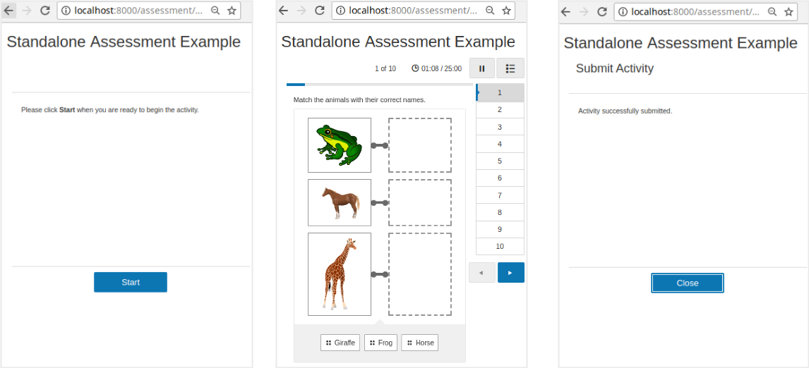

<p align="center"></p>
<h1 align="center">Learnosity SDK - Python</h1>
<p align="center">Everything you need to start building your app in Learnosity, with the Python programming language.<br> 
(Prefer another language? <a href="https://help.learnosity.com/hc/en-us/sections/360000194318-Server-side-development-SDKs">Click here</a>)<br>
An official Learnosity open-source project.</p>

[](https://pypi.org/project/learnosity_sdk/)
[](https://app.travis-ci.com/Learnosity/learnosity-sdk-python)
[](LICENSE.md)
[](https://github.com/Learnosity/learnosity-sdk-python/releases)
---

## Table of Contents

* [Overview: what does it do?](#overview-what-does-it-do)
* [Requirements](#requirements)
* [Installation](#installation)
* [Quick start guide](#quick-start-guide)
* [Next steps: additional documentation](#next-steps-additional-documentation)
* [Contributing to this project](#contributing-to-this-project)
* [License](#license)
* [Usage tracking](#usage-tracking)
* [Further reading](#further-reading)

## Overview: what does it do?
The Learnosity Python SDK makes it simple to interact with Learnosity APIs.


It provides a number of convenience features for developers, that make it simple to do the following essential tasks:
* Creating signed security requests for API initialization, and
* Interacting with the Data API.

For example, the SDK helps with creating a signed request for Learnosity:


Once the SDK has created the signed request for you, your app sends that on to an API in the Learnosity cloud, which then retrieves the assessment you are asking for, as seen in the diagram below:


This scenario is what you can see running in the Quick start guide example ([see below](#quick-start-guide)).

There's more features, besides. See the detailed list of SDK features on the [reference page](REFERENCE.md).

[(Back to top)](#table-of-contents)

## Requirements
1. Runtime libraries for Python 3 installed. ([instructions](https://www.python.org/downloads/))

2. The [Pip](https://pip.pypa.io/en/latest/) package manager installed. You use Pip to access the Learnosity Python SDK on [Pypi](https://pypi.org/) (the [Python Package Index](https://pypi.org/)).

3. The [Jinja](https://jinja.palletsprojects.com/)** templating library. For the tutorial on this page, you will also need [Jinja](https://jinja.palletsprojects.com/) installed. Jinja helps in rendering HTML templates, and importing Python variables into web pages. It's not actually a requirement of the SDK itself, so if your app doesn't use Jinja, no need to install it. **  Jinja is only required for the tutorial on this page.

Not using Python? See the [SDKs for other languages](https://help.learnosity.com/hc/en-us/sections/360000194318-Server-side-development-SDKs).

### Supported Python Versions

We support all versions that have a status of `bugfix` or `security` on [this](https://devguide.python.org/#status-of-python-branches) list.

[(Back to top)](#table-of-contents)

## Installation
###  **Installation via Pip**
Using Pip is the recommended way to install the Learnosity SDK for Python in production. The easiest way is to run this from your parent project folder:

    pip install learnosity_sdk

Then, if you're following the tutorial on this page, also run:

    pip install learnosity_sdk[quickstart]

### **Alternative method 1: download the zip file**
Download the latest version of the SDK as a self-contained ZIP file from the [GitHub Releases](https://github.com/Learnosity/learnosity-sdk-python/releases) page. The distribution ZIP file contains all the necessary dependencies. 

Note: after installation, run this command in the SDK root folder:

    pip install .

### **Alternative 2: development install from a git clone**
To install from the terminal, run the following command:

    git clone git@github.com:Learnosity/learnosity-sdk-python.git

To set up up your local development environment, use the following:

    python3 -m venv .venv/learnosity-sdk-python
    source .venv/learnosity-sdk-python/bin/activate
    pip install -e .

Note that these manual installation methods are for development and testing only.
For production use, you should install the SDK using the Pip package manager for Python, as described above.

[(Back to top)](#table-of-contents)

## Quick start guide
Let's take a look at a simple example of the SDK in action. In this example, we'll load an assessment into the browser.

### **Start up your web server and view the standalone assessment example**
To start up your Python web server, run the following command:

    learnosity-sdk-assessment-quickstart

Note: this will run the code in [standalone_assessment.py](docs/quickstart/assessment/standalone_assessment.py).

From this point on, we'll assume that your web server is available at this local address (it will report the port being used when you launch it, by default it's port 8000).

http://localhost:8000/

You can now access the APIs using the following URL [click here](http://localhost:8000).


Following are the routes to access our APIs.

* Author API : http://localhost:8000/authorapi
* Questions API : http://localhost:8000/questionsapi
* Items API : http://localhost:8000/itemsapi
* Reports API : http://localhost:8000/reportsapi
* Question Editor API : http://localhost:8000/questioneditorapi

Open these pages with your web browser. These are all basic examples of Learnosity's integration. You can interact with these demo pages to try out the various APIs. The Items API example is a basic example of an assessment loaded into a web page with Learnosity's assessment player. You can interact with this demo assessment to try out the various Question types.



[(Back to top)](#table-of-contents)

### **How it works**
Let's walk through the code for this standalone assessment example. The source file is included under the quickstart folder: [standalone_assessment.py](docs/quickstart/assessment/standalone_assessment.py).

The first section of code is Python and is executed server-side. It constructs a set of configuration options for Items API, and securely signs them using the consumer key. The second section is HTML and JavaScript and is executed client-side, once the page is loaded in the browser. It renders and runs the assessment functionality.

[(Back to top)](#table-of-contents)

### **Server-side code**
We start by including some LearnositySDK helpers - they'll make it easy to generate and sign the config options, and generate unique user and session IDs.

``` python
from learnosity_sdk.request import Init # Learnosity helper.
from learnosity_sdk.utils import Uuid   # Learnosity helper.
from .. import config          # config.py, which stores the consumer key and secret.
```

We also specify a few libraries to run a minimal web server, for the purposes of this example.

``` python
from http.server import BaseHTTPRequestHandler, HTTPServer # Python web server.
from jinja2 import Template             # Jinja template library - pulls data into web pages.
```

We generate UUIDs for the user ID and session ID.

``` python
user_id = Uuid.generate()
session_id = Uuid.generate()
```

We choose the host domain and port number for our local web server.

``` python
host = "localhost"
port = 8000
```

Now we'll declare the configuration parameters for Items API. These specify which assessment content should be rendered, how it should be displayed, which user is taking this assessment and how their responses should be stored. 

``` python
items_request = items_request = {
    "user_id": user_id,
    "activity_template_id": "quickstart_examples_activity_template_001",
    "session_id": session_id,
    "activity_id": "quickstart_examples_activity_001",
    "rendering_type": "assess",
    "type": "submit_practice",
    "name": "Items API Quickstart",
    "state": "initial"
}
```

* `user_id`: unique student identifier. Note: we never send or save student's names or other personally identifiable information in these requests. The unique identifier should be used to look up the entry in a database of students accessible within your system only. [Learn more](https://help.learnosity.com/hc/en-us/articles/360002309578-Student-Privacy-and-Personally-Identifiable-Information-PII-).
* `activity_template_id`: reference of the Activity to retrieve from the Item bank. The Activity defines which Items will be served in this assessment.
* `session_id`: uniquely identifies this specific assessment attempt for save/resume, data retrieval and reporting purposes. Here, we're using the `Uuid` helper to auto-generate a unique session id.
* `activity_id`: a string you define, used solely for analytics to allow you run reporting and compare results of users submitting the same assessment.
* `rendering_type`: selects a rendering mode, `assess` mode is a "standalone" mode (loading a complete assessment player for navigation, as opposed to `inline` for embedding without).
* `type`: selects the context for the student response storage. `submit_practice` mode means the student responses will be stored in the Learnosity cloud, allowing for grading and review.
* `name`: human-friendly display name to be shown in reporting, via Reports API and Data API.
* `state`: Optional. Can be set to `initial`, `resume` or `review`. `initial` is the default.

**Note**: you can submit the configuration options either as a Python array as shown above, or a JSON string.

Next, we declare the Learnosity consumer credentials we'll use to authorize this request. We also construct security settings that ensure the report is initialized on the intended domain. The value provided to the domain property must match the domain from which the file is actually served. The consumer key and consumer secret in this example are for Learnosity's public "demos" account. Once Learnosity provides your own consumer credentials, your Item bank and assessment data will be tied to your own consumer key and secret.

``` python
security = {
    'consumer_key': config.consumer_key,
    'domain': host,
}
```

<i>(of course, you should never normally put passwords into version control)</i>

Now we call LearnositySDK's `Init()` helper to construct our Items API configuration parameters, and sign them securely with the `security`, `request` and `config.consumer_secret` parameters. `init.generate()` returns us a JSON blob of signed configuration parameters.

``` python
init = Init(
    'items', security, config.consumer_secret,
    request=items_request
)
generated_request = init.generate()
```

[(Back to top)](#table-of-contents)

### **Web page content**
We've got our set of signed configuration parameters, so now we can set up our page content for output. The page can be as simple or as complex as needed, using your own HTML, JavaScript and your frameworks of choice to render the desired product experience.

This example uses plain HTML in a Jinja template, served by the built-in Python web server. However, the Jinja template used here can be easily re-used in another framework, for example Python Flask or Django.

The following example HTML/Jinja template can be found near the bottom of the [standalone_assessment.py](docs/quickstart/assessment/standalone_assessment.py) file.

``` python
        template = Template("""<!DOCTYPE html>
        <html>
            <head>
                <link rel="stylesheet" type="text/css" href="../css/style.css">
            </head>
            <body>
                <h1>{{ name }}</title></h1>
                <!-- Items API will render the assessment app into this div. -->
                <div id="learnosity_assess"></div>
                <!-- Load the Items API library. -->
                <script src=\"https://items.learnosity.com/?latest-lts/\"></script>
                <!-- Initiate Items API assessment rendering, using the signed parameters. -->
                <script>
                    var itemsApp = LearnosityItems.init( {{ generated_request }} );
                </script>
            </body>
        </html>
        """)
```

The important parts to be aware of in this HTML are:

* A div with `id="learnosity_assess"`. This is where the Learnosity assessment player will be rendered to deliver the assessment.
* The `<script src="https://items.learnosity.com/?latest-lts"></script>` tag, which includes Learnosity's Items API on the page and makes the global `LearnosityItems` object available. The version specified as `latest-lts` will retrieve the latest version supported. To know more about switching to specific LTS version visit [Long Term Support (LTS) version](https://help.learnosity.com/hc/en-us/articles/360001268538-Release-Cadence-and-Version-Lifecycle). In production, you should always pin to a specific LTS version to ensure version compatibility.
* The call to `LearnosityItems.init()`, which initiates Items API to inject the assessment player into the page.
* The variable `{{generated_request}}` dynamically sends the contents of our init options to JavaScript, so it can be passed to `init()`.

The call to `init()` returns an instance of the ItemsApp, which we can use to programmatically drive the assessment using its methods. We pull in our Learnosity configuration in a variable `{{ generated_request }}`, that the Jinja template will import from the Python program. The variable `{{ name }}` is the page title which can be set in the same way.

The Jinja template is rendered by the following line, which will bring in those variables.

``` python
    response = template.render(name='Standalone Assessment Example', generated_request=generated_request) 
```

There is some additional code in [standalone_assessment.py](docs/quickstart/assessment/standalone_assessment.py), which runs Python's built-in web server. 

This marks the end of the quick start guide. From here, try modifying the example files yourself, you are welcome to use this code as a basis for your own projects. As mentioned earlier, the Jinja template used here can be easily re-used in another framework, for example Python Flask or Django.

Take a look at some more in-depth options and tutorials on using Learnosity assessment functionality below.

[(Back to top)](#table-of-contents)

## Next steps: additional documentation

### **SDK reference**
See a more detailed breakdown of all the SDK features, and examples of how to use more advanced or specialised features on the [SDK reference page](REFERENCE.md).

### **Additional quick start guides**
There are more quick start guides, going beyond the initial quick start topic of loading an assessment, these further tutorials show how to set up authoring and analytics:
* [Authoring Items quick start guide](https://help.learnosity.com/hc/en-us/articles/360000754958-Getting-Started-With-the-Author-API) (Author API) - create and edit new Questions and Items for your Item bank, then group your assessment Items into Activities, and
* [Analytics / student reporting quick start guide](https://help.learnosity.com/hc/en-us/articles/360000755838-Getting-Started-With-the-Reports-API) (Reports API) - view the results and scores from an assessment Activity. 

### **Learnosity demos repository**
On our [demo site](https://demos.learnosity.com/), browse through many examples of Learnosity API integration. You can also download the entire demo site source code, the code for any single demo, or browse the codebase directly on GitHub.

### **Learnosity reference documentation**
See full documentation for Learnosity API init options, methods and events in the [Learnosity reference site](https://reference.learnosity.com/).

### **Technical use-cases documentation**
Find guidance on how to select a development pattern and arrange the architecture of your application with Learnosity, in the [Technical Use-Cases Overview](https://help.learnosity.com/hc/en-us/articles/360000757777-Technical-Use-Cases-Overview).

### **Deciding what to build or integrate**
Get help deciding what application functionality to build yourself, or integrate off-the-shelf with the [Learnosity "Golden Path" documentation](https://help.learnosity.com/hc/en-us/articles/360000754578-Recommended-Deployment-Patterns-Golden-Path-).

### **Key Learnosity concepts**
Want more general information about how apps on Learnosity actually work? Take a look at our [Key Learnosity Concepts page](https://help.learnosity.com/hc/en-us/articles/360000754638-Key-Learnosity-Concepts).

### **Glossary**
Need an explanation for the unique Learnosity meanings for Item, Activity and Item bank? See our [Glossary of Learnosity-specific terms](https://help.learnosity.com/hc/en-us/articles/360000754838-Glossary-of-Learnosity-and-Industry-Terms).

[(Back to top)](#table-of-contents)

## Contributing to this project

### Adding new features or fixing bugs
Contributions are welcome. See the [contributing instructions](CONTRIBUTING.md) page for more information. You can also get in touch via our support team.

[(Back to top)](#table-of-contents)

## License
The Learnosity Python SDK is licensed under an Apache 2.0 license. [Read more](LICENSE.md).

[(Back to top)](#table-of-contents)

## Usage tracking
Our SDKs include code to track the following information by adding it to the request being signed:
- SDK version
- SDK language
- SDK language version
- Host platform (OS)
- Platform version

We use this data to enable better support and feature planning.

[(Back to top)](#table-of-contents)

## Further reading
Thanks for reading to the end! Find more information about developing an app with Learnosity on our documentation sites: 

* [help.learnosity.com](http://help.learnosity.com/hc/en-us) -- general help portal and tutorials,
* [reference.learnosity.com](http://reference.learnosity.com) -- developer reference site, and
* [authorguide.learnosity.com](http://authorguide.learnosity.com) -- authoring documentation for content creators.

[(Back to top)](#table-of-contents)
